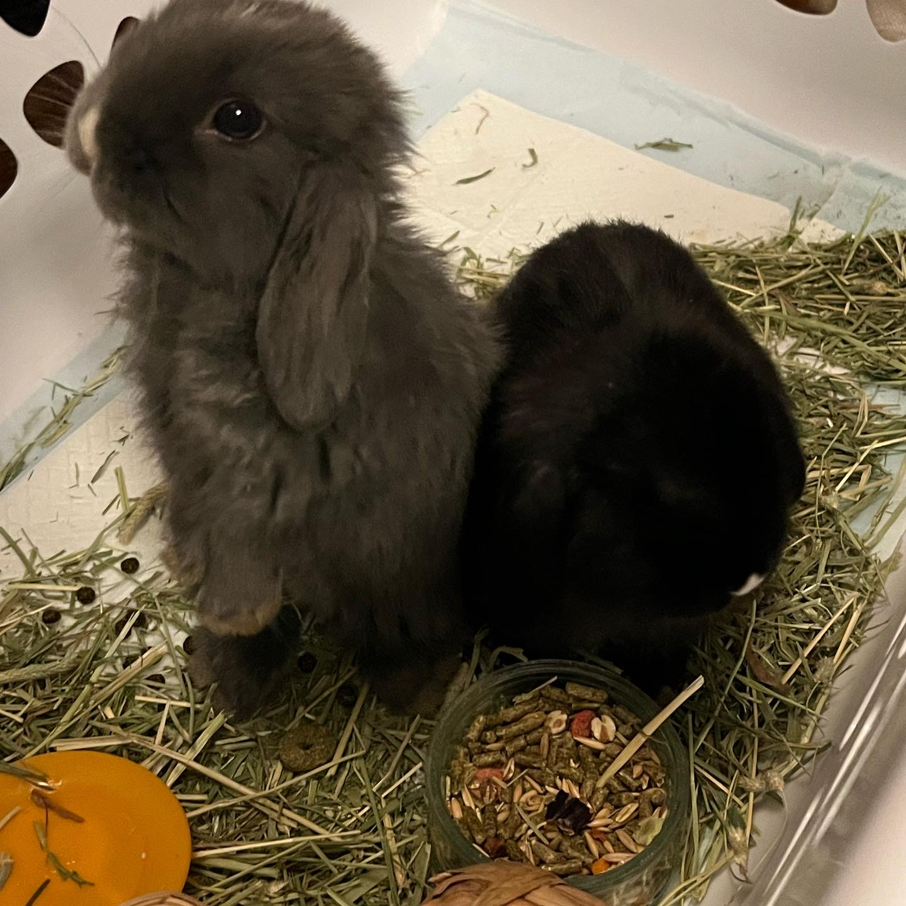

# Hi, I'm Audrey!

## About me

I'm a second year Computer Science major with a minor in Art History! I've lived in San Diego my whole life but I'm always exploring the city and love to find new eats!

### Interests/Hobbies
- Crochet
- Video Games
- Ice skating

### Places on my travel list:
1. Croatia
2. Philippines
3. Japan
4. Switzerland
5. Italy

*I just got my passport (finally!), so I'm really excited to start travelling*

### My Pets
I have 2 bunnies (Itchie and Scratchie) and 3 chinchillas (Walnut, Mouse and Mochi)

*my bunnies when they were babies*

link to this photo:[Link to photo of my bunnies](./bunnies.jpeg)

### Links
My Crochet Instagram:[@audrey.crochets on Instagram](https://instagram.com/audrey.crochets)

My Personal Instagram: [@audreymousey on Instagram](https://instagram,com/audreymousey)

- Go to **About Me**: [Go to About Me](#about-me)

### Quote
> "I saw the angel in the marble and carved until I set him free." -Michelangelo

### Code
`print("Hello, world!")`

### To-Do List
- [x] go to store
- [ ] finish homework
- [ ] prep for upcoming market
